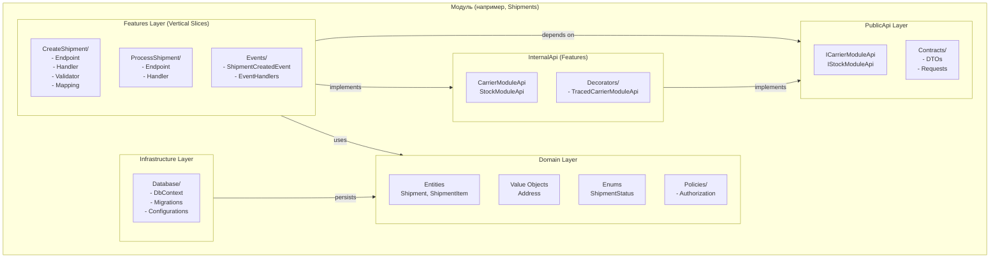
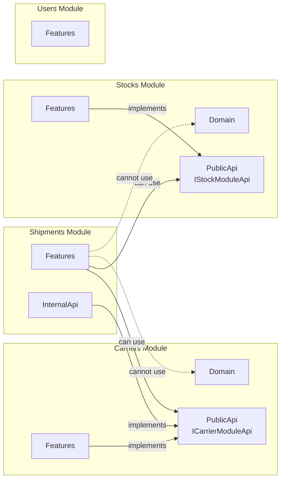
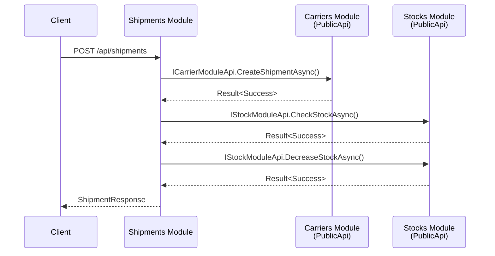
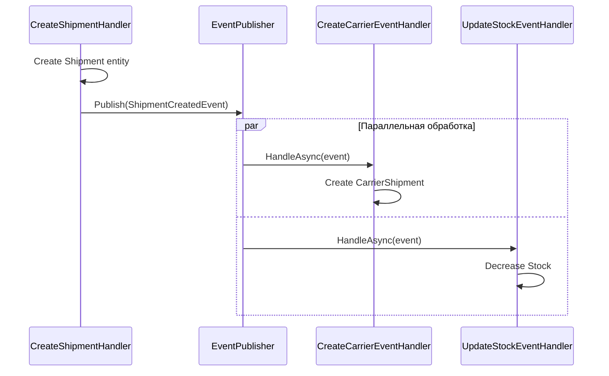
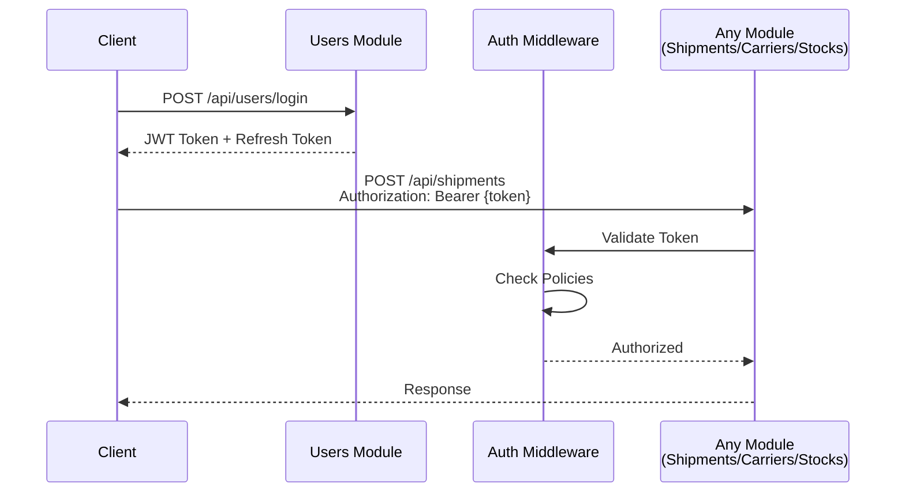
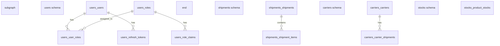
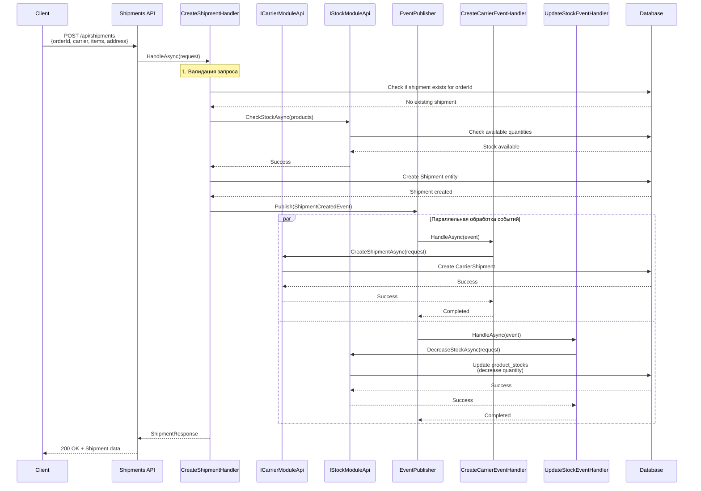
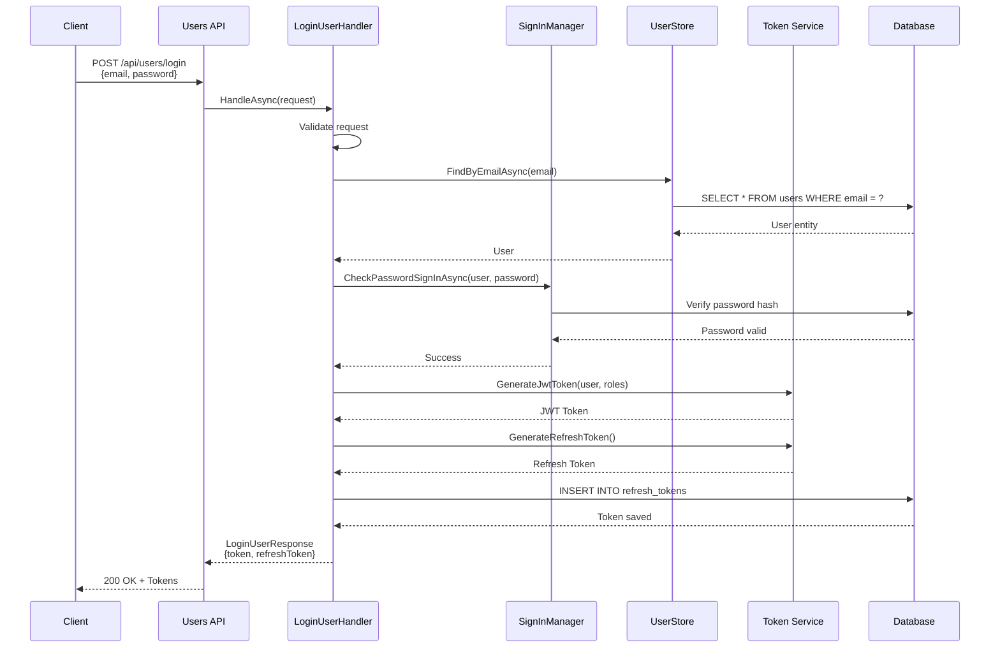
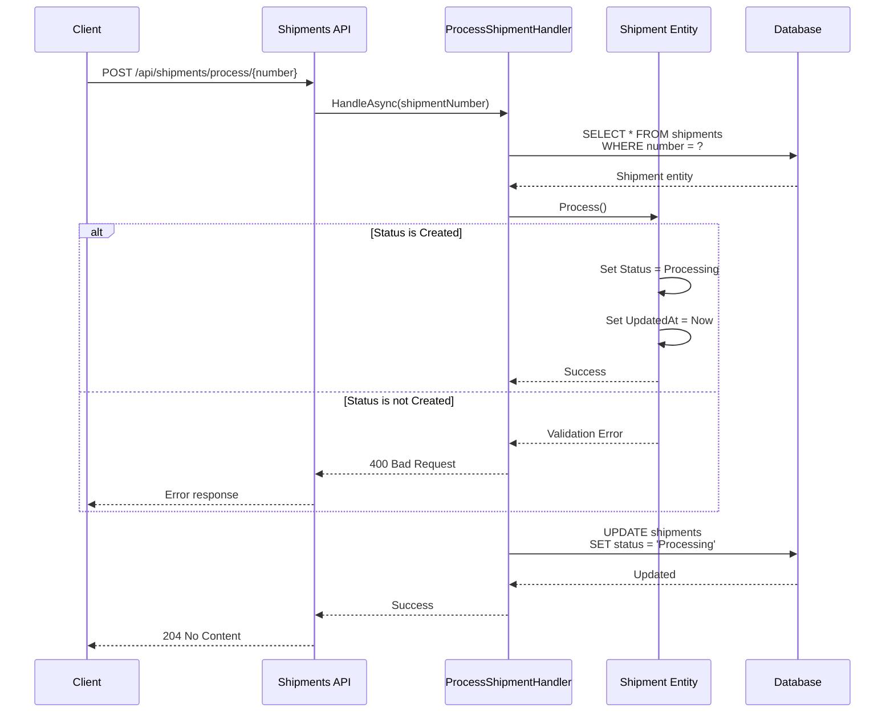
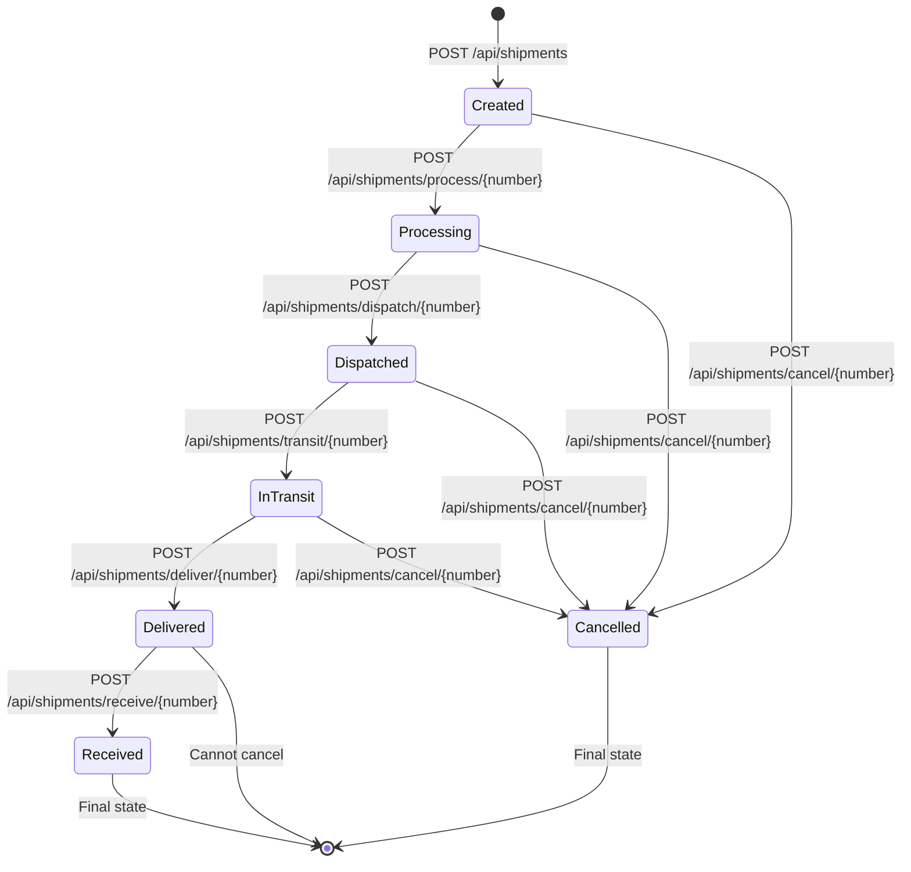

# Архитектурная и функциональная схема проекта

## Содержание

1. [Общая архитектура](#общая-архитектура)
2. [Модули системы](#модули-системы)
3. [Взаимодействие модулей](#взаимодействие-модулей)
4. [База данных](#база-данных)
5. [Функциональные потоки](#функциональные-потоки)
6. [Технологический стек](#технологический-стек)

---

## Общая архитектура

Проект построен на основе **Modular Monolith** архитектуры с использованием принципов **Clean Architecture** и **Vertical Slices**.

### Архитектурные принципы

- **Modular Monolith**: Все модули развернуты как единое приложение, но изолированы друг от друга
- **Clean Architecture**: Разделение на слои (Domain, Application, Infrastructure)
- **Vertical Slices**: Функциональность организована по бизнес-сценариям, а не по техническим слоям
- **Dependency Inversion**: Модули взаимодействуют только через PublicApi интерфейсы

### Структура модуля

Каждый модуль следует единой структуре:



**Ключевые файлы:**
- Domain: [Shipments/Modules.Shipments.Domain/Entities/Shipment.cs](Shipments/Modules.Shipments.Domain/Entities/Shipment.cs)
- Features: [Shipments/Modules.Shipments.Features/DependencyInjection.cs](Shipments/Modules.Shipments.Features/DependencyInjection.cs)
- Infrastructure: [Shipments/Modules.Shipments.Infrastructure/DependencyInjection.cs](Shipments/Modules.Shipments.Infrastructure/DependencyInjection.cs)
- PublicApi: [Carriers/Modules.Carriers.PublicApi/ICarrierModuleApi.cs](Carriers/Modules.Carriers.PublicApi/ICarrierModuleApi.cs)

---

## Модули системы

### Users Module

**Назначение**: Аутентификация и авторизация пользователей

**Основные компоненты:**
- JWT токены и refresh tokens
- Identity Core для управления пользователями
- Роли и политики авторизации

**API Endpoints:**
- `POST /api/users/register` - Регистрация пользователя
- `POST /api/users/login` - Аутентификация
- `POST /api/users/refresh-token` - Обновление токена
- `GET /api/users/{id}` - Получение пользователя
- `PUT /api/users/{id}` - Обновление пользователя
- `DELETE /api/users/{id}` - Удаление пользователя

**Структура:**
```
Users/
├── Modules.Users.Domain/          # User, Role, RefreshToken entities
├── Modules.Users.Features/         # Login, Register, RefreshToken handlers
└── Modules.Users.Infrastructure/   # Identity, DbContext, Authorization
```

### Shipments Module

**Назначение**: Управление жизненным циклом отправлений

**Основные компоненты:**
- Создание и управление отправлениями
- Отслеживание статусов (Created → Processing → Dispatched → InTransit → Delivered → Received)
- Интеграция с Carriers и Stocks модулями

**API Endpoints:**
- `POST /api/shipments` - Создание отправления
- `GET /api/shipments/{number}` - Получение отправления
- `POST /api/shipments/process/{number}` - Обработка
- `POST /api/shipments/dispatch/{number}` - Отправка
- `POST /api/shipments/transit/{number}` - В пути
- `POST /api/shipments/deliver/{number}` - Доставка
- `POST /api/shipments/receive/{number}` - Получение
- `POST /api/shipments/cancel/{number}` - Отмена

**Структура:**
```
Shipments/
├── Modules.Shipments.Domain/       # Shipment, ShipmentItem entities
├── Modules.Shipments.Features/     # Vertical slices для каждого use case
└── Modules.Shipments.Infrastructure/ # DbContext, Migrations
```

### Carriers Module

**Назначение**: Управление перевозчиками

**Основные компоненты:**
- Создание и управление перевозчиками
- Создание отправлений перевозчиков
- Проверка активности перевозчиков

**API Endpoints:**
- `POST /api/carriers` - Создание перевозчика
- `GET /api/carriers/active` - Получение активных перевозчиков

**Структура:**
```
Carriers/
├── Modules.Carriers.Domain/         # Carrier, CarrierShipment entities
├── Modules.Carriers.Features/      # CreateCarrier, CreateShipment handlers
├── Modules.Carriers.Infrastructure/ # DbContext
└── Modules.Carriers.PublicApi/     # ICarrierModuleApi для межмодульного взаимодействия
```

### Stocks Module

**Назначение**: Управление складскими запасами

**Основные компоненты:**
- Создание и управление товарными запасами
- Проверка наличия товаров
- Уменьшение запасов при создании отправлений

**API Endpoints:**
- `POST /api/stocks` - Создание запаса
- `GET /api/stocks/by-product-name` - Получение по имени продукта
- `POST /api/stocks/increase` - Увеличение запаса

**Структура:**
```
Stocks/
├── Modules.Stocks.Domain/           # ProductStock entity
├── Modules.Stocks.Features/        # CheckStock, DecreaseStock handlers
├── Modules.Stocks.Infrastructure/  # DbContext
└── Modules.Stocks.PublicApi/       # IStockModuleApi для межмодульного взаимодействия
```

### Common Module

**Назначение**: Общие компоненты и утилиты

**Основные компоненты:**
- **Common.Domain**: Result pattern, Events, IHandler
- **Common.API**: IApiEndpoint, ErrorHandling, Extensions
- **Common.Application**: EventPublisher, Handler registration
- **Common.Infrastructure**: Database migrations, Policies

**Ключевые файлы:**
- [Common/Modules.Common.Domain/Results/Result.cs](Common/Modules.Common.Domain/Results/Result.cs)
- [Common/Modules.Common.Application/EventPublisher.cs](Common/Modules.Common.Application/EventPublisher.cs)
- [Common/Modules.Common.API/Extensions/MapEndpointExtensions.cs](Common/Modules.Common.API/Extensions/MapEndpointExtensions.cs)

---

## Взаимодействие модулей

### Правила зависимостей

Модули могут взаимодействовать только через **PublicApi** интерфейсы. Прямые зависимости на Domain, Features или Infrastructure других модулей запрещены.



### Межмодульное взаимодействие

**1. Через PublicApi интерфейсы (синхронное)**

Shipments модуль вызывает Carriers и Stocks через их PublicApi:



**2. Через события (асинхронное)**

При создании shipment публикуется событие, которое обрабатывается несколькими handlers:



**Ключевые файлы:**
- [Shipments/Modules.Shipments.Features/Features/CreateShipment/Events/CreateCarrierEventHandler.cs](Shipments/Modules.Shipments.Features/Features/CreateShipment/Events/CreateCarrierEventHandler.cs)
- [Shipments/Modules.Shipments.Features/Features/CreateShipment/Events/UpdateStockEventHandler.cs](Shipments/Modules.Shipments.Features/Features/CreateShipment/Events/UpdateStockEventHandler.cs)
- [Common/Modules.Common.Application/EventPublisher.cs](Common/Modules.Common.Application/EventPublisher.cs)

### Аутентификация

Модули не вызывают Users модуль напрямую. Вместо этого:
1. Клиент получает JWT токен через `/api/users/login`
2. Токен используется в заголовке `Authorization: Bearer {token}`
3. ASP.NET Core middleware валидирует токен
4. Модули проверяют политики авторизации



---

## База данных

### Архитектура базы данных

Все модули используют одну PostgreSQL базу данных, но с изолированными схемами:



### Схемы модулей

**Users Schema (`users`)**
- `users` - Пользователи (Identity)
- `roles` - Роли
- `user_roles` - Связь пользователей и ролей
- `role_claims` - Права доступа ролей
- `refresh_tokens` - Refresh токены

**Shipments Schema (`shipments`)**
- `shipments` - Отправления
  - `id` (UUID)
  - `number` (string)
  - `order_id` (string)
  - `carrier` (string)
  - `receiver_email` (string)
  - `status` (enum)
  - `address_street`, `address_city`, `address_zip`
  - `created_at`, `updated_at`
- `shipment_items` - Товары в отправлении
  - `id` (int)
  - `shipment_id` (UUID, FK)
  - `product` (string)
  - `quantity` (int)

**Carriers Schema (`carriers`)**
- `carriers` - Перевозчики
  - `id` (UUID)
  - `name` (string)
  - `is_active` (boolean)
- `carrier_shipments` - Отправления перевозчиков
  - `id` (UUID)
  - `carrier_id` (UUID, FK)
  - `order_id` (string)
  - `shipping_address_street`, `shipping_address_city`, `shipping_address_zip`
  - `created_at` (timestamp)

**Stocks Schema (`stocks`)**
- `product_stocks` - Товарные запасы
  - `id` (UUID)
  - `product_name` (string)
  - `available_quantity` (int)
  - `last_updated_at` (timestamp)

### Миграции

Каждый модуль имеет свои миграции в отдельной таблице истории:
- `users.migration_history`
- `shipments.migration_history`
- `carriers.migration_history`
- `stocks.migration_history`

Миграции выполняются автоматически при запуске в режиме Development.

**Ключевые файлы:**
- [Common/Modules.Common.Infrastructure/Database/DatabaseMigrationExtensions.cs](Common/Modules.Common.Infrastructure/Database/DatabaseMigrationExtensions.cs)
- [Users/Modules.Users.Infrastructure/Database/UsersDbContext.cs](Users/Modules.Users.Infrastructure/Database/UsersDbContext.cs)
- [Shipments/Modules.Shipments.Infrastructure/Database/ShipmentsDbContext.cs](Shipments/Modules.Shipments.Infrastructure/Database/ShipmentsDbContext.cs)

---

## Функциональные потоки

### 1. Создание Shipment

Полный поток создания отправления с взаимодействием всех модулей:



**Ключевые файлы:**
- [Shipments/Modules.Shipments.Features/Features/CreateShipment/CreateShipment.Handler.cs](Shipments/Modules.Shipments.Features/Features/CreateShipment/CreateShipment.Handler.cs)
- [Shipments/Modules.Shipments.Features/Features/CreateShipment/Events/ShipmentCreatedEvent.cs](Shipments/Modules.Shipments.Features/Features/CreateShipment/Events/ShipmentCreatedEvent.cs)

### 2. Аутентификация пользователя



**Ключевые файлы:**
- [Users/Modules.Users.Features/Users/LoginUser/LoginUser.Handler.cs](Users/Modules.Users.Features/Users/LoginUser/LoginUser.Handler.cs)

### 3. Обновление статуса Shipment



**Ключевые файлы:**
- [Shipments/Modules.Shipments.Features/Features/ProcessShipment/ProcessShipment.Handler.cs](Shipments/Modules.Shipments.Features/Features/ProcessShipment/ProcessShipment.Handler.cs)
- [Shipments/Modules.Shipments.Domain/Entities/Shipment.cs](Shipments/Modules.Shipments.Domain/Entities/Shipment.cs) (метод `Process()`)

### 4. Жизненный цикл Shipment

Полный цикл от создания до получения:



---

## Технологический стек

### Основные технологии

| Технология | Назначение | Версия |
|-----------|-----------|--------|
| .NET | Платформа разработки | 10.0 |
| ASP.NET Core | Web framework | 10.0 |
| Entity Framework Core | ORM | 10.0 |
| PostgreSQL | База данных | Latest |
| FluentValidation | Валидация | Latest |
| Serilog | Логирование | Latest |
| OpenTelemetry | Observability | Latest |

### Инфраструктура

| Сервис | Назначение | Порт |
|--------|-----------|------|
| PostgreSQL | База данных | 5432 |
| Seq | Централизованное логирование | 5341, 8081 |
| Jaeger | Distributed tracing | 4317, 4318, 16686 |

### Архитектурные паттерны

- **Result Pattern**: Обработка ошибок без исключений
  - [Common/Modules.Common.Domain/Results/Result.cs](Common/Modules.Common.Domain/Results/Result.cs)
- **Handler Pattern**: Обработка use cases
  - [Common/Modules.Common.Domain/Handlers/IHandler.cs](Common/Modules.Common.Domain/Handlers/IHandler.cs)
- **Event-Driven**: Асинхронная обработка событий
  - [Common/Modules.Common.Domain/Events/IEvent.cs](Common/Modules.Common.Domain/Events/IEvent.cs)
- **Decorator Pattern**: Трейсинг для межмодульных вызовов
  - [Carriers/Modules.Carriers.Features/InternalApi/Decorators/TracedCarrierModuleApi.cs](Carriers/Modules.Carriers.Features/InternalApi/Decorators/TracedCarrierModuleApi.cs)

### Конфигурация

**Точка входа:** [ModularMonolith.Host/Program.cs](ModularMonolith.Host/Program.cs)

**Регистрация модулей:**
- [Users/Modules.Users.Features/DependencyInjection.cs](Users/Modules.Users.Features/DependencyInjection.cs)
- [Shipments/Modules.Shipments.Features/DependencyInjection.cs](Shipments/Modules.Shipments.Features/DependencyInjection.cs)
- [Carriers/Modules.Carriers.Features/DependencyInjection.cs](Carriers/Modules.Carriers.Features/DependencyInjection.cs)
- [Stocks/Modules.Stocks.Features/DependencyInjection.cs](Stocks/Modules.Stocks.Features/DependencyInjection.cs)

---

## Заключение

Проект демонстрирует современный подход к построению модульных монолитов с четким разделением ответственности, изоляцией модулей и гибким механизмом межмодульного взаимодействия. Архитектура позволяет легко масштабировать отдельные модули в будущем при необходимости перехода на микросервисы.
